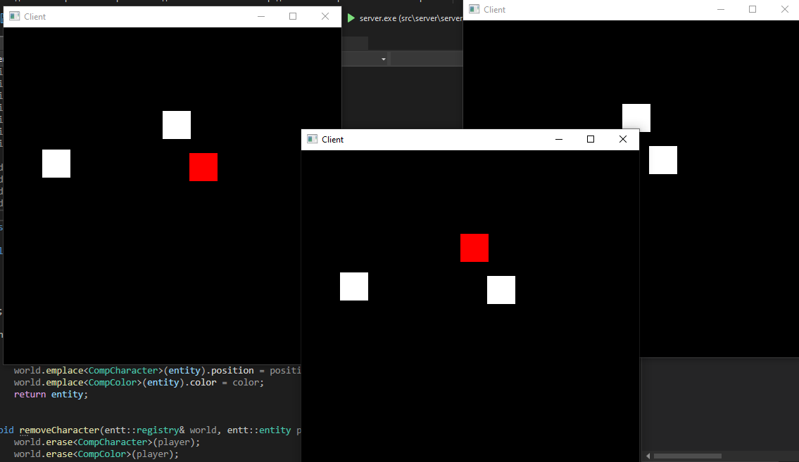

# MultiplayerTest

This is a prototype of my networking engine. Now I'm learning the low level game networking to implement it in my game engine [VisualRay3D](https://github.com/Dxftoro/VisualRay3D).
The goal of this project is to understand the game netcode basics, so I'm not aiming to make something complex.



The prototype also shows a quite messy, but working client interpolation feature.

# Build

Building is trivial using CMake:
```bash
cmake -B out # or build
cmake --build out --config Debug # or Release
```

# Requirements

- CMake 3.8+
- C++23 compiler

# Usage

After building, run the server and client from `out/bin`.